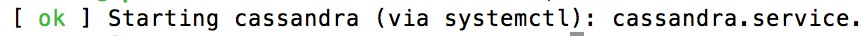
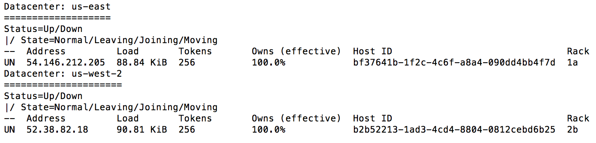
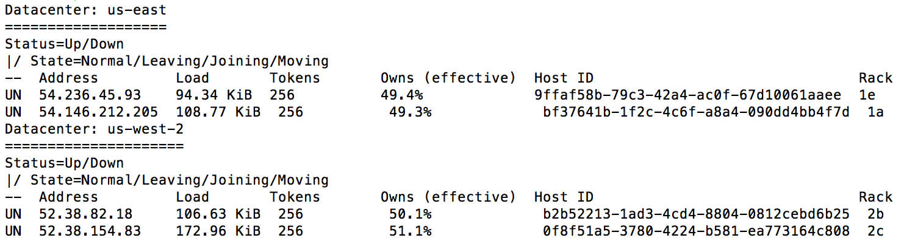
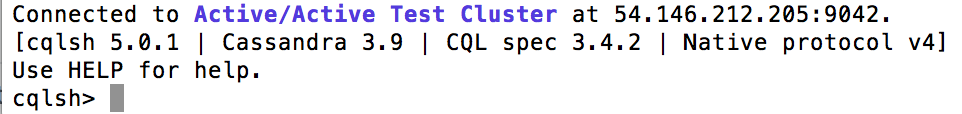

# CS308 VCU Capstone Project

## Active/Active Cloud Infrastructure 
The cloud platform for this project is Amazon Web Services (https://aws.amazon.com). All of the necessary project files can be downloaded from https://github.com/jacksonc4/CS308.git

Group members
---
Curtis Jackson 

Charles Bradshaw 

Edwin Lobo

Description
---

This repository will guide you through the steps necessary to create and test a multi-regional cluster of AWS nodes running the NoSQL database Cassandra.

Instance Set-up
---

1. From the AWS cli, create two Security Groups. Once they are created they do not need to be created again.
  * This needs to be done once for each region in which resources will deployed (us-west-2, us-east-1).
 ```
 aws ec2 --region us-west-2 create-security-group --group-name ClusterTestEnv --description "Opens ports for cluster comms"
 aws ec2 --region us-east-1 create-security-group --group-name ClusterTestEnv --description "Opens ports for cluster comms"
 ```
  * Clone this repo locally, and change the working directory to the 'shell_scripts' folder. Modify the 'us_west_2_rules.sh' and 'us_east_1_rules.sh' files to be executable and run each of them once to assign rules to the groups.
  * Take note of the group Ids that are given after group creation to use when creating EC2 instances.
    
2. Create some EC2 instances to test on with the following AWS cli commands:
```
aws ec2 --region us-west-2 run-instances image-id ami-f4cc1de2 --security-group-ids <the Id for the us-west-2 security group previously created> --count 2 --instance-type m3.medium --key-name <previously created west key, omit the .pem>
aws ec2 --region us-east-1 run-instances image-id ami-f4cc1de2 --security-group-ids <the Id for the us-east-1 security group previously created> --count 2 --instance-type m3.medium --key-name <previously created east key, omit the .pem>
```
  
3. SSH into each of your instances and clone this repo to the main directory.
  
4. Change the properties of the cassandra_install script file to executable, and then run the cassandra_install script on each node.
  ```
  cd /shell_scripts
  sudo chmod +x ./cassandra_install.sh
  ./cassandra_install.sh
  ```
 
Cassandra Cluster Set-up
 ---
Now that Cassandra has been installed on each of your nodes, the cluster has to be configured to get each node gossiping.

On each node, do the following:

* Point to the Cassandra directory, and look for the cassandra.yaml and cassandra-rackdc.properties files.
  ```
  cd /etc/cassandra/
  
  ls
  
  cassandra.yaml  cassandra-rackdc.properties . . .  
  ```
* Use your preferred text editor (vim for us) to edit the following properties in the cassandra.yaml file:
  1. Cluster Name
  2. Listen Address
  3. Broadcast Address
  4. rpc Address
  5. Seeds
  6. Endpoint Snitch
  
* Each of these should be set to the following, depending on the current node:
  1. cluster_name: 'Name does not matter -- but must be the same on every node'
  2. listen_address: privateIP of the current node
  3. broadcast_address: publicIP of the current node
  4. rpc_address: privateIP of the current node
  5. seeds: "publicIPs of each desired seed node -- must have at least one per datacenter, separated by a comma"
  6. endpoint_snitch: Ec2MultiRegionSnitch
  
* Once the settings are properly configured, save the updates and exit from the text editor. Next, edit the cassandra-rackdc.properties file in the same way.
  - On each node, scroll to the bottom and uncomment the line reading 'prefer_local.' Save the update and exit from the text editor.
  
At this point, the node configurations should be properly set. Use the following command to start each node individually (start seeds first).
```
sudo /etc/init.d/cassandra start
```
The output should look like this:


If not, then something may have went wrong with installation.

Once each node has been brought up, verify that the cluster is up and running with
```
nodetool status
```
Cluster with seeds booted first:
---


Cluster with all nodes active:
---


Cassandra Cluster testing
 ---
Now that the Cassandra cluster has been created, it may be tested using the Cassandra demo code. Before using this, a keyspace called 'demo' must be created.

Use the Cassandra Query Language shell on any node to create the keyspace with the following command: 
```
cqlsh <privateIP of node>
```
This should look like:


Now, create the demo keyspace:
```
CREATE KEYSPACE demo WITH replication = {'class':'NetworkTopologyStrategy', '<first DC>':<desired # of replicas>', . . . , '<last DC>':<desired # of replicas>'} AND durable_writes = true;
```
where the DC is the name of the AWS region where you have nodes deployed (i.e. us-west-2), and number of replicas determines how many copies of your data are sent throughout the ring (an odd number > 2 is recommended).

Once the keyspace has been created, grab the demo code from the Cassandra file in this repo. Open the source code of the createDB.java file and edit the following lines of code to suit your needs:
```
  //Change x to be equal to the data volume you wish to send to the cluster
  TextGenerator.createFile(x);
  
  //Change the contatct point to be the public IP of whichever node you wish to connect to
  cluster = Cluster.builder().addContactPoint("public IP").withPort(9042).build();
```

After the code has completed its execution, you may use cqlsh again to verify that the data has been sent to the cluster and distributed throughout the ring (there will be several results to tab through depending on the data volume sent to cluster).
```
cqlsh <public IP of node>
use demo;
select * from users;
```

Use the following command to drop the sample table:
```
drop table users;
```
